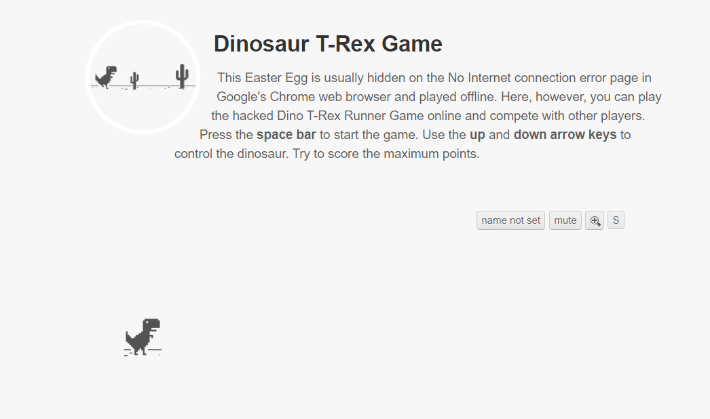

# << IN PROGRESS >>
# Computer Vision Model for beating the Dinosaur Game

Source code for the OpenCV Object Detection in Games series on the **Learn Code By Gaming** YouTube channel.

[**Heavy Inspiration from the following codebase!**](https://github.com/learncodebygaming/opencv_tutorials)

[**His Nifty tutorials can be found here on YouTube**](https://www.youtube.com/playlist?list=PL1m2M8LQlzfKtkKq2lK5xko4X-8EZzFPI)

---
## The Link to the Dinosaur Game can be found [**Here**](https://trex-runner.com/)
 

### Window Capture Folder
- Tools for taking a screen shot for the dinosaur game. I will be using this to store the appropriate PNG files into its associated folders (Jump, Duck).

### Dinosaur_Game_Data_Exploration.ipynb 
- Playing around with Windows OS and checking to see if functions work. 

### Future Line of Work
- Study which Computer vision model is most appropriate to beating the game at runtime
- Train Model on Screenshots from the Window Capture Folder
- Integrate with System (as a microservice)
- Potentially deploy for others to use
